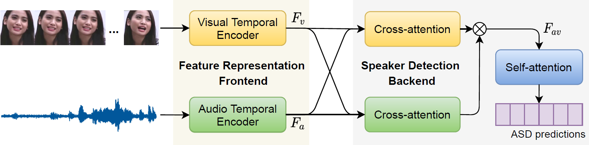

## Is someone talking? TalkNet: Audio-visual active speaker detection Model

This repository contains the code for our ACM MM 2021 paper, [TalkNet](https://arxiv.org/pdf/2107.06592.pdf), an active speaker detection model to detect 'whether the face in the screen is speaking or not?'.



- [**Awesome ASD**](https://github.com/TaoRuijie/TalkNet_ASD/blob/main/awesomeASD.md): Papers about active speaker detection in last years.

- **TalkNet in AVA-Activespeaker dataset**: The code to preprocess the AVA-ActiveSpeaker dataset, train TalkNet in AVA train set and evaluate it in AVA val/test set. 

- **TalkNet in TalkSet and Columbia ASD dataset**: The code to generate TalkSet, an ASD dataset in the wild, based on VoxCeleb2 and LRS3, train TalkNet in TalkSet and evaluate it in Columnbia ASD dataset.

- **An ASD Demo with pretrained TalkNet model**: An end-to-end script to detect and mark the speaking face by the pretrained TalkNet model. 

***

### Dependencies

Start from building the environment
```
conda create -n TalkNet python=3.7.9 anaconda
conda activate TalkNet
pip install -r requirements.txt
```

Start from the existing environment
```
pip install -r requirements.txt
```

***

## TalkNet in AVA-Activespeaker dataset

#### Data preparation

The following script can be used to download and prepare the AVA dataset for training.

```
python trainTalkNet.py --dataPathAVA AVADataPath --download 
```

`AVADataPath` is the folder you want to save the AVA dataset and its preprocessing outputs, the details can be found in [here](https://github.com/TaoRuijie/TalkNet_ASD/blob/main/utils/tools.py#L34) . Please read them carefully.

#### Training
Then you can train TalkNet in AVA end-to-end by using:
```
python trainTalkNet.py --dataPathAVA AVADataPath
```
`exps/exps1/score.txt`: output score file, `exps/exp1/model/model_00xx.model`: trained model, `exps/exps1/val_res.csv`: prediction for val set.

#### Pretrained model
Our pretrained model performs `mAP: 92.3` in validation set, you can check it by using: 
```
python trainTalkNet.py --dataPathAVA AVADataPath --evaluation
```
The pretrained model will automaticly be downloaded into `TalkNet_ASD/pretrain_AVA.model`. It performs `mAP: 90.8` in the testing set. 

***

## TalkNet in TalkSet and Columbia ASD dataset

#### Data preparation

We find that it is challenge to apply the model we trained in AVA for the videos not in AVA (Reason is [here](https://github.com/TaoRuijie/TalkNet_ASD/blob/main/FAQ.md), Q1). So we build TalkSet, an active speaker detection dataset in the wild, based on `VoxCeleb2` and `LRS3`.

We do not plan to upload this dataset since we just modify it, instead of building it. In `TalkSet` folder we provide these `.txt` files to describe which files we used to generate the TalkSet and their ASD labels. You can generate this `TalkSet` if you are interested to train an ASD model in the wild.

Also, we have provided our pretrained TalkNet model in TalkSet. You can evaluate it in Columbia ASD dataset or other raw videos in the wild.

#### Usage

A pretrain model in TalkSet will be download into `TalkNet_ASD/pretrain_TalkSet.model` when using the following script:

```
python demoTalkNet.py --evalCol --colSavePath colDataPath
```

Also, Columnbia ASD dataset and the labels will be downloaded into `colDataPath`. Finally you can get the following F1 result.

| Name |  Bell  |  Boll  |  Lieb  |  Long  |  Sick  |  Avg.  |
|----- | ------ | ------ | ------ | ------ | ------ | ------ |
|  F1  |  98.1  |  88.8  |  98.7  |  98.0  |  97.7  |  96.3  |

(This result is different from that in our paper because we train the model again, while the avg. F1 is very similar)
***

## An ASD Demo with pretrained TalkNet model

#### Data preparation

We build an end-to-end script to detect and extract the active speaker from the raw video by our pretrain model in TalkSet. 

You can put the raw video (`.mp4` and `.avi` are both fine) into the `demo` folder, such as `001.mp4`.

#### Usage

```
python demoTalkNet.py --video_name 001
```

A pretrain model in TalkSet will be downloaded into `TalkNet_ASD/pretrain_TalkSet.model`. The structure of the output reults can be found in [here](https://github.com/TaoRuijie/TalkNet_ASD/blob/main/demoTalkNet.py#L351).

You can get the output video `demo/001/pyavi/video_out.avi`, which has marked the active speaker by green box and non-active speaker by red box.

***

### Citation

Please cite the following if our paper or code is helpful to your research.
```
@article{tao2021TalkNet,
  title={Is Someone Speaking? Exploring Long-term Temporal Features for Audio-visual Active Speaker Detection},
  author={Ruijie Tao, Zexu Pan, Rohan Kumar Das, Xinyuan Qian, Mike Zheng Shou, Haizhou Li},
  journal={ACM Multimedia (MM)},
  year={2021}
}
```

I have summaried some potential [FAQs](https://github.com/TaoRuijie/TalkNet_ASD/blob/main/FAQ.md). This is my first open-source work, please let me know if I can future improve in this repositories. Thanks for your support!